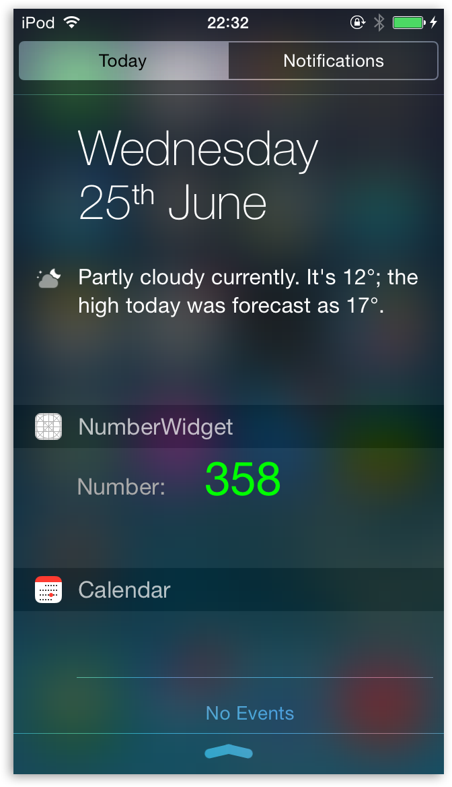
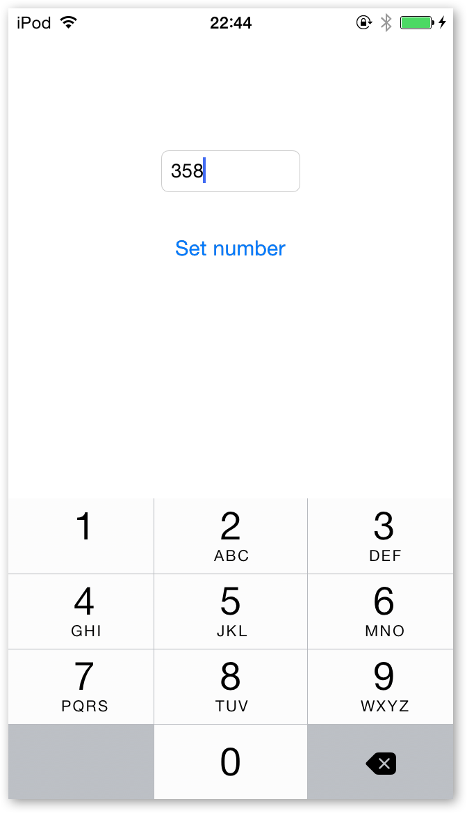

TodayExtensionSharingDefaults
=============================

As the name suggests, this is a sample iOS 8 Today extension which shares data with its containing app using NSUserDefaults.

For detailed step-by-step tutorial, check out this <a href="http://www.glimsoft.com/06/28/ios-8-today-extension-tutorial/">blog post</a>.

If you have any questions, use the comments section on the blog or contact me on Twitter <a href="http://twitter.com/luksape" target="_blank">@luksape</a>.

 
